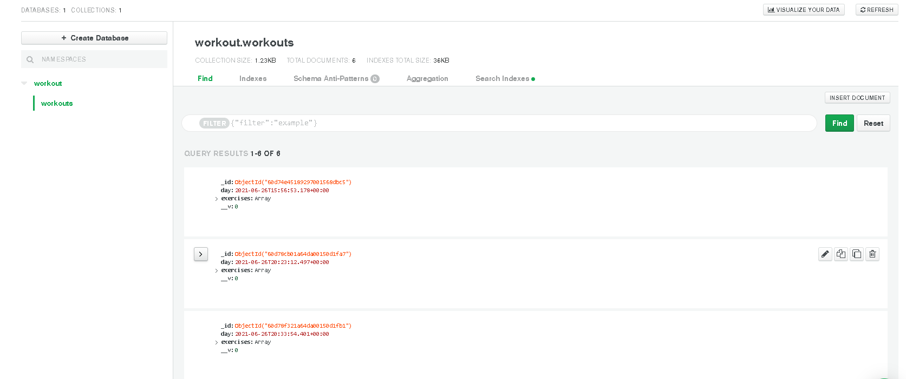

# Fitness-Tracker
This is a fitness tracking application, where the user can enter information into the app to view stats on their workouts completed, and create a new workout to be logged. The logged information is stored through a server database so no worries about local storage and possible losing your fitness journal.

## Deployed app
This app is deployed through Heroku, will the storage of the applications database is saved through mongoose server database.

https://pure-plains-23966.herokuapp.com/?id=60d791df1a64da00150d1fbb

 App

Database

## Demo 

### Technologies used 
- JavaScript 
- Express
- Node.js
- Mongoose
- Heroku